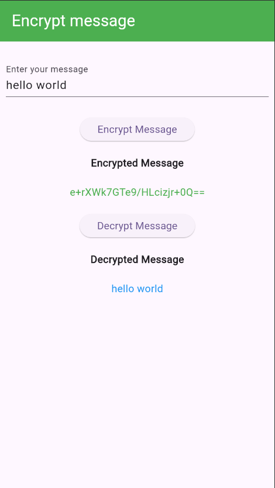

# Encryption & Decryption Demo in Flutter

Encryption & Decryption Demonstration in Flutter using the AES encryption algorithm. The app allows users to input a message, encrypt it with a secure key, and then decrypt it to view the original message.

## Screenshots

## Features
- Message Encryption: Enter a plain text message, and the app encrypts it using AES encryption.
- Message Decryption: Decrypt the encrypted message back to its original plain text.
- User Interface: A clean and simple UI with options to encrypt and decrypt messages.

## How It Works
- Input: The user enters a message in the text field.
- Encryption: When the "Encrypt Message" button is clicked, the app encrypts the message using the AES encryption algorithm with a 16-character key and initialization vector (IV).
- Decryption: After encryption, the "Decrypt Message" button decrypts the encrypted message back into the original text.
- Display: The encrypted message is shown in green, and the decrypted message is displayed in blue.

## Future Enhancements
- Allow users to set their own encryption key.
- Save encrypted messages locally or on the cloud.
- Add options for different encryption algorithms.